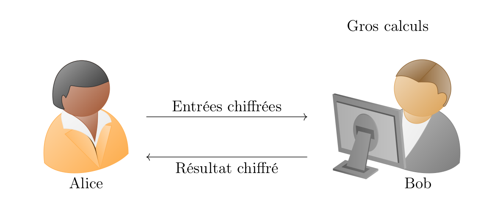
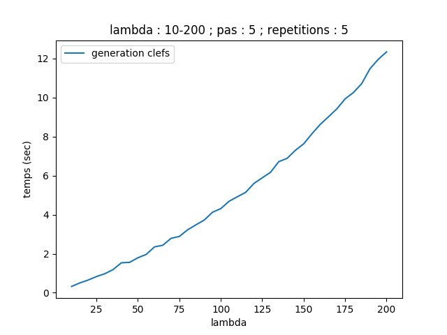
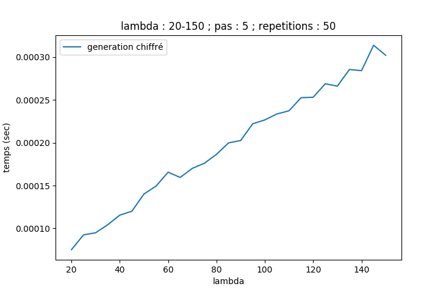
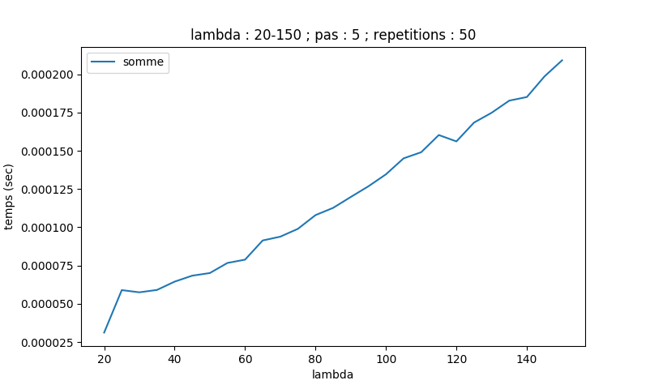
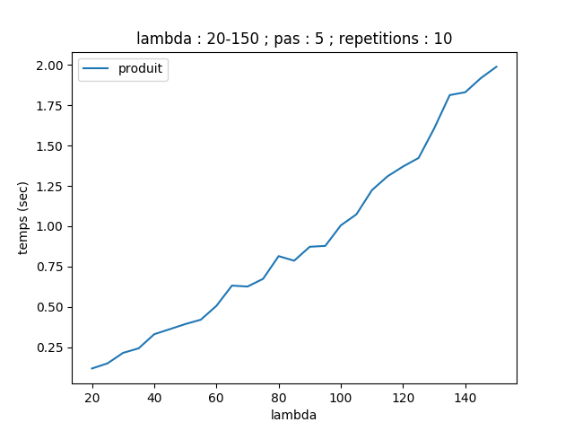

# Étude et implémentation d’un schéma de chiffrement homomorphe

TIPE réalisé pendant l'année scolaire 2018-2019 par Clément Rambaud et Milan Gonzalez-Thauvin. Ma présentation orale (individuelle) a été sanctionné par la note de **15,7/20** (Tétraconcours)



## Motivation
La cryptographie homomorphe est une cryptographie en pleine construction. C'est donc l'optique d'apporter ma pierre à l'édifice qui m'a poussé à choisir ce sujet. De plus, la cryptographie est une discipline mêlant mathématiques et informatique, au cœur des problématiques technologiques et sociales d'internet aujourd'hui.

## Ancrage au thème
Le transport sécurisé d'informations est un enjeu majeur de notre société. Dans ce contexte, la cryptographie homomorphe permet non seulement de protéger des données mais aussi et surtout de calculer directement sur des chiffrés. C'est donc la délégation sécurisée de calculs qui est au cœur du thème "Transport".

## Positionnements thématique
* INFORMATIQUE (Informatique pratique)
* INFORMATIQUE (Informatique Théorique)

## Mots-clés
* Cryptographie                / Cryptography
* Chiffrement homomorphe       / Homomorphic encryption
* Chiffrement asymétrique      / Public-key cryptography
* Chiffrement sur les entiers  / Encryption over the integers
* Réamorçage                   / Bootstrap


## Bibliographie commentée
La cryptographie est une science qui se développe depuis l'antiquité. En effet, un des premier schémas de chiffrement, le chiffrement César, était déjà utilisé par l'empire romain. Ce schéma assez sommaire utilise une unique clef pour chiffrer et déchiffrer un message d'où sa qualification de chiffrement "symétrique". Depuis, de nombreux autres schémas ont vu le jour, mais un en particulier révolutionna la cryptographie : en 1978, R. Rivest, A. Shamir et L. Adleman publient le système RSA, un chiffrement révolutionnaire basé sur la difficulté de la factorisation de grands nombres. Ce dernier utilise notamment une clef publique pour chiffrer des données et une clef privée pour les déchiffrer, ce qui en fait un schéma asymétrique. Mais un défaut à ce système est remarqué : le produit de deux chiffrés est égal au chiffré du produit. Il est donc possible d'effectuer sous certaines conditions certaines opérations sans posséder la clef privé, nécessaire au déchiffrement [3]. Ce défaut apparent ouvre néanmoins de nouvelles perspectives : la capacité d'effectuer des calculs sur les données chiffrées sans y avoir accès.  
Plusieurs schémas sont alors apparus dans ce sens, certains permettant d'effectuer des additions, d'autres d'effectuer des additions et des multiplications en nombre fini; mais le problème d'un schéma de chiffrement "complètement homomorphe" (fully homomorphic) permettant d'effectuer des additions et multiplications en nombre infini, et donc d'évaluer la majorité des fonctions utilisées par un ordinateur, est resté très longtemps ouvert.  
Ce n'est qu'en 2009 que le premier schéma complètement homomorphe voit le jour, proposé par Craig Gentry dans sa thèse [5]. Ce schéma se basant sur des réseaux euclidiens utilise la difficulté du Shortest Vector Problem (SVP) et du Closest Vector Problem (CVP). L'approche ingénieuse de Gentry est la suivante : on élabore dans un premier temps un schéma qui n'accepte qu'un nombre limité d'opérations consécutives puis, lorsqu'un chiffré approche de cette limite, on l'évalue homomorphiquement au travers de la fonction de déchiffrement (elle-même composée d'addition et multiplication, donc compatible avec le schéma). Cela revient à chiffrer un chiffré obsolète en un chiffré neuf sur lequel il est de nouveau possible d'effectuer des opérations. Cette manoeuvre est appelée réamorçage ou bootstrap [5, 6]. Il est ainsi possible d'effectuer un nombre illimité d'opérations en faisant un bootstrap régulièrement. Cependant le schéma de Gentry est un schéma complexe, très théorique et inutilisable en pratique du fait de la taille des clefs et de la lenteur du bootstrap.  
D'autres schémas ont alors été créés, certains visant à améliorer le schéma de Gentry pour le rendre plus efficace, d'autres visant à ouvrir d'autres pistes que celle des réseaux euclidiens tout en gardant l'astuce du bootstrap. Deux en particulier ont attiré notre attention, utilisant les propriétés des entiers naturels et se basant sur la difficulté du problème du PGCD approché [1, 2].  
Aujourd'hui aucun schéma n'est utilisable en pratique bien que la recherche ait bien avancé et que certaines applications très précises soient envisageables. La recherche se poursuit.  
La cryptographie homomorphe est amenée à occuper une place importante dans l'environnement numérique de demain ; la digitalisation de nombreux services (nécessitant notamment de calculer sur des données confidentielles) et l'essort des objets connectés (smartphones, tablettes, Internet des Objets) avec une petite puissance de calcul en disent long sur ses applications les plus probables : vote électronique et délégation sécurisée de calculs sur un serveur puissant mais peu fiable.

## Problématique
Qu'est-ce que le chiffrement homomorphe et quelles sont ses caractéristiques ?  
Comment l'étude et l'implémentation d'un algorithme spécifique nous renseignent-t-elles sur son fonctionnement ?  
Quelles sont les applications concrètes de la cryptographie homomorphe aujourd'hui et demain ?

## Objectifs
* apréhender les problématiques et les enjeux de la cryptographie d'aujourd'hui
* comprendre les bases mathématiques qui guarantissent la sécurité de la cryptographie homomorphe ainsi que son bon fonctionnement
* implémenter un schéma de chiffrement complètement homomorphe, l'améliorer pour le rendre performant et donc utilisable dans un contexte concret
* utiliser cette implémentation dans une application concrète, de préférence en relation avec les enjeux cités précédemment

## Références bibliographiques

\[1] Jung Hee Cheon, Damien Stehlé: Fully homomorphic encryption over the integers revisited, 2016
\[2] M. van Dijk, C. Gentry, S. Helevi, V. Vaikuntanathan: Fully homomorphic encryption over the integers, 2010
\[3] G. Zémor: Cours de cryptographie, 2000 Cassini
\[4] J. A. Buchmann, J. Vélu: Introduction a la cryptographie, 2006 Dunod
\[5] C. Gentry: Fully Homomorphic Encryption Using Ideal Lattices, 2009
\[6] C. Gentry: A fully homomorphic encryption scheme, 2009


# Implémentation

Implémentation en Python3.

## Exemple d'utilisation

```
lambdaa, nb_operations = 50, 1000

alice, bob = genererCS(lambdaa, nb_operations)
a = bob.chiffrerentier(5)
b = bob.chiffrerentier(4)
c = (a*b)
print(alice.dechiffrerentier(c))
```

## Performances temporelles





